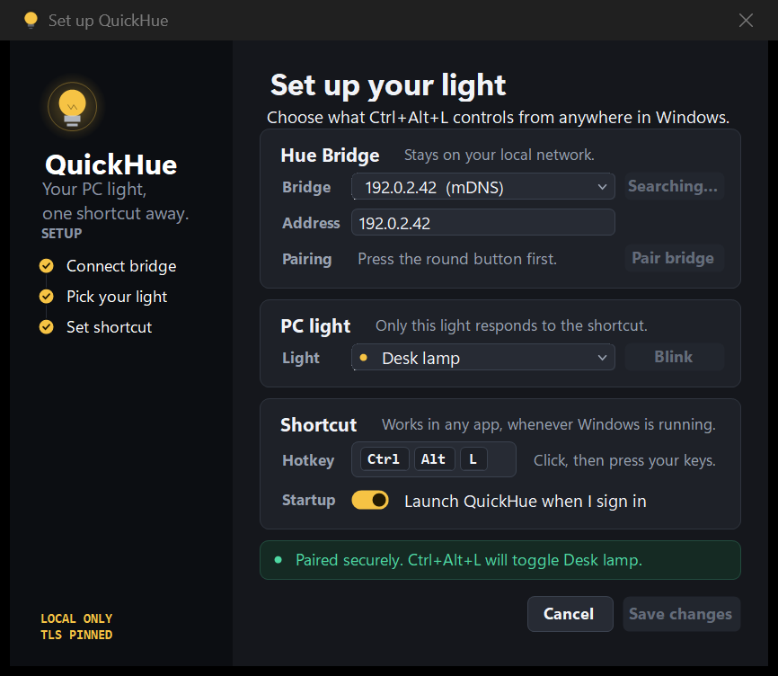

# QuickHue

QuickHue is a small Windows 11 tray utility for switching one Philips Hue bulb as quickly as possible.



- Press `Ctrl+Alt+L` from any application, or pick your own shortcut.
- Left-click the tray icon.
- Right-click for explicit On, Off, Settings, startup, and Exit actions.
- Commands go directly to the Hue Bridge over the local network using Hue API v2 and HTTPS.

The tray icon shows the light's state at a glance: a lit bulb when on, an outline when off, and a crossed-out bulb when the bridge is unreachable. Settings and the tray menu follow the Windows light or dark app theme, including the title bar.

## Install

Requirements:

- Windows 11 x64
- Hue Bridge v2 or Bridge Pro on the same LAN
- [.NET 10 Windows Desktop Runtime](https://dotnet.microsoft.com/download/dotnet/10.0)

Download `QuickHue-vX.Y.Z-win-x64.zip` from the
[latest release](../../releases/latest), extract it, and run `QuickHue.exe`.
QuickHue is not code-signed yet, so Windows SmartScreen may show a warning.

To build and install the current source instead:

```powershell
.\scripts\install.ps1
```

On first launch:

1. Let QuickHue discover the bridge, or enter its IP address.
2. Press the round button on the bridge.
3. Click **Pair bridge**.
4. Select the PC bulb. **Blink** flashes it twice so you can confirm you picked the right one.
5. Save.

The side rail tracks which of those steps are done. To change the shortcut, click the hotkey field and press the combination you want — QuickHue checks it against Windows straight away and tells you if another app already owns it.

QuickHue stores settings in `%LocalAppData%\QuickHue`. The application key is encrypted for the current Windows user with DPAPI. The bridge TLS certificate is pinned during physical pairing and checked on every later connection.

Discovery uses HueApi's local mDNS and SSDP locators first, Hue's discovery service in parallel, and HueApi's bounded LAN scan only if the fast methods return nothing. Internet access is not required after pairing.

## Develop and test

Development requires Windows 11 and the .NET 10 SDK. The repository pins a
compatible SDK and a locked NuGet dependency graph.

```powershell
dotnet restore QuickHue.slnx --locked-mode
dotnet build QuickHue.slnx --configuration Release --no-restore
dotnet format QuickHue.slnx --verify-no-changes --no-restore
dotnet run --project .\tests\QuickHue.Tests\QuickHue.Tests.csproj --configuration Release --no-build
```

To review UI changes without a bridge, render the settings window, tray menu, and tray icons to PNG in both themes:

```powershell
dotnet run --project .\tests\QuickHue.Tests\QuickHue.Tests.csproj -c Release -- --ui-preview .\artifacts\ui
```

The app uses the MIT-licensed `HueApi` package for bridge discovery. Light commands and event tracking use QuickHue's certificate-pinned Hue API v2 client. See [THIRD_PARTY_NOTICES.md](THIRD_PARTY_NOTICES.md) for dependency attribution.

## Releases

CI builds, formats, tests, and verifies the single-file Windows publish on every
pull request and push to `main`.

Pushing a semantic version tag creates a GitHub release with a framework-dependent
Windows x64 archive and SHA-256 checksum:

```powershell
git tag v1.0.0
git push origin v1.0.0
```

## Uninstall

```powershell
.\scripts\uninstall.ps1
```

Add `-PurgeConfig` to also remove the saved settings and encrypted bridge key.

## Contributing and security

See [CONTRIBUTING.md](CONTRIBUTING.md) for the development and pull-request
workflow. Report vulnerabilities privately as described in
[SECURITY.md](SECURITY.md).

## License

QuickHue is available under the [MIT License](LICENSE).
